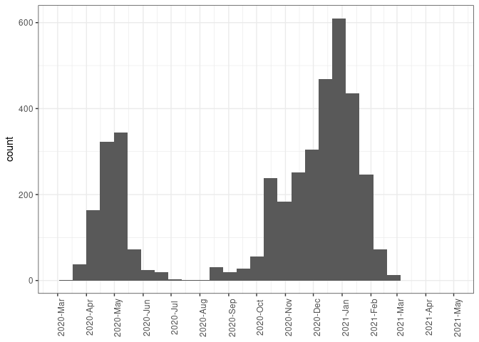

## Introduction

This is an exploratory/remembering-how-to-use-R notebook, exploring a
dataset of already-aligned ORW genomes from COG-UK.

    metadata <- read.csv("/home/madeline/QIB_Internship/COG-UK-data/ORW_metadata.csv", header=TRUE)

    summary(metadata)

    ##  central_sample_id  sequence_name      secondary_identifier sample_date       
    ##  Length:3992        Length:3992        Mode:logical         Length:3992       
    ##  Class :character   Class :character   NA's:3992            Class :character  
    ##  Mode  :character   Mode  :character                        Mode  :character  
    ##  epi_week         country              adm1           is_surveillance   
    ##  Mode:logical   Length:3992        Length:3992        Length:3992       
    ##  NA's:3992      Class :character   Class :character   Class :character  
    ##                 Mode  :character   Mode  :character   Mode  :character  
    ##  is_travel_history travel_history   lineage          lineage_support
    ##  Mode:logical      Mode:logical   Length:3992        Mode:logical   
    ##  NA's:3992         NA's:3992      Class :character   NA's:3992      
    ##                                   Mode  :character                  
    ##   uk_lineage        del_lineage         phylotype        
    ##  Length:3992        Length:3992        Length:3992       
    ##  Class :character   Class :character   Class :character  
    ##  Mode  :character   Mode  :character   Mode  :character

    names(metadata)

    ##  [1] "central_sample_id"    "sequence_name"        "secondary_identifier"
    ##  [4] "sample_date"          "epi_week"             "country"             
    ##  [7] "adm1"                 "is_surveillance"      "is_travel_history"   
    ## [10] "travel_history"       "lineage"              "lineage_support"     
    ## [13] "uk_lineage"           "del_lineage"          "phylotype"

    head(metadata)

    ##   central_sample_id            sequence_name secondary_identifier sample_date
    ## 1       LIVE-E0239E England/LIVE-E0239E/2021                   NA  2021-02-14
    ## 2       NORW-22D223 England/NORW-22D223/2021                   NA  2021-02-10
    ## 3       NORW-22D1CC England/NORW-22D1CC/2021                   NA  2021-02-13
    ## 4       NORW-22D162 England/NORW-22D162/2021                   NA  2021-02-13
    ## 5       NORW-22B37D England/NORW-22B37D/2021                   NA  2021-01-09
    ## 6       NORW-22D2C9 England/NORW-22D2C9/2021                   NA  2021-02-10
    ##   epi_week country   adm1 is_surveillance is_travel_history travel_history
    ## 1       NA      UK UK-ENG               Y                NA             NA
    ## 2       NA      UK UK-ENG               Y                NA             NA
    ## 3       NA      UK UK-ENG               N                NA             NA
    ## 4       NA      UK UK-ENG               Y                NA             NA
    ## 5       NA      UK UK-ENG               Y                NA             NA
    ## 6       NA      UK UK-ENG               N                NA             NA
    ##   lineage lineage_support uk_lineage     del_lineage
    ## 1 B.1.1.7              NA     UK1476 del_trans_26865
    ## 2 B.1.1.7              NA     UK1476 del_trans_26865
    ## 3 B.1.1.7              NA     UK1364 del_trans_22142
    ## 4 B.1.1.7              NA     UK1476 del_trans_26865
    ## 5 B.1.1.7              NA      UK736 del_trans_26121
    ## 6 B.1.1.7              NA     UK1476 del_trans_26865
    ##                       phylotype
    ## 1 UK1476_1.33.13.70.46.1.48.1.1
    ## 2  UK1476_1.33.10.59.1.1.10.1.2
    ## 3                 UK1364_1.12.2
    ## 4       UK1476_1.33.10.59.1.1.1
    ## 5                     UK736_1.4
    ## 6   UK1476_1.33.13.265.18.1.1.4

## Exploration

Total counts over all time for each lineage:

<table>
<thead>
<tr class="header">
<th style="text-align: left;">Var1</th>
<th style="text-align: right;">Freq</th>
</tr>
</thead>
<tbody>
<tr class="odd">
<td style="text-align: left;"></td>
<td style="text-align: right;">47</td>
</tr>
<tr class="even">
<td style="text-align: left;">B</td>
<td style="text-align: right;">76</td>
</tr>
<tr class="odd">
<td style="text-align: left;">B.1</td>
<td style="text-align: right;">137</td>
</tr>
<tr class="even">
<td style="text-align: left;">B.1.1.1</td>
<td style="text-align: right;">20</td>
</tr>
<tr class="odd">
<td style="text-align: left;">B.1.1.10</td>
<td style="text-align: right;">8</td>
</tr>
<tr class="even">
<td style="text-align: left;">B.1.1.101</td>
<td style="text-align: right;">1</td>
</tr>
<tr class="odd">
<td style="text-align: left;">B.1.1.102</td>
<td style="text-align: right;">2</td>
</tr>
<tr class="even">
<td style="text-align: left;">B.1.1.114</td>
<td style="text-align: right;">9</td>
</tr>
<tr class="odd">
<td style="text-align: left;">B.1.1.115</td>
<td style="text-align: right;">1</td>
</tr>
<tr class="even">
<td style="text-align: left;">B.1.1.119</td>
<td style="text-align: right;">254</td>
</tr>
<tr class="odd">
<td style="text-align: left;">B.1.1.127</td>
<td style="text-align: right;">28</td>
</tr>
<tr class="even">
<td style="text-align: left;">B.1.1.130</td>
<td style="text-align: right;">9</td>
</tr>
<tr class="odd">
<td style="text-align: left;">B.1.1.147</td>
<td style="text-align: right;">1</td>
</tr>
<tr class="even">
<td style="text-align: left;">B.1.1.159</td>
<td style="text-align: right;">1</td>
</tr>
<tr class="odd">
<td style="text-align: left;">B.1.1.164</td>
<td style="text-align: right;">1</td>
</tr>
<tr class="even">
<td style="text-align: left;">B.1.1.170</td>
<td style="text-align: right;">20</td>
</tr>
<tr class="odd">
<td style="text-align: left;">B.1.1.175</td>
<td style="text-align: right;">2</td>
</tr>
<tr class="even">
<td style="text-align: left;">B.1.1.182</td>
<td style="text-align: right;">4</td>
</tr>
<tr class="odd">
<td style="text-align: left;">B.1.1.183</td>
<td style="text-align: right;">10</td>
</tr>
<tr class="even">
<td style="text-align: left;">B.1.1.184</td>
<td style="text-align: right;">2</td>
</tr>
<tr class="odd">
<td style="text-align: left;">B.1.1.189</td>
<td style="text-align: right;">5</td>
</tr>
<tr class="even">
<td style="text-align: left;">B.1.1.198</td>
<td style="text-align: right;">199</td>
</tr>
<tr class="odd">
<td style="text-align: left;">B.1.1.208</td>
<td style="text-align: right;">2</td>
</tr>
<tr class="even">
<td style="text-align: left;">B.1.1.211</td>
<td style="text-align: right;">1</td>
</tr>
<tr class="odd">
<td style="text-align: left;">B.1.1.215</td>
<td style="text-align: right;">9</td>
</tr>
<tr class="even">
<td style="text-align: left;">B.1.1.220</td>
<td style="text-align: right;">1</td>
</tr>
<tr class="odd">
<td style="text-align: left;">B.1.1.240</td>
<td style="text-align: right;">3</td>
</tr>
<tr class="even">
<td style="text-align: left;">B.1.1.251</td>
<td style="text-align: right;">3</td>
</tr>
<tr class="odd">
<td style="text-align: left;">B.1.1.269</td>
<td style="text-align: right;">16</td>
</tr>
<tr class="even">
<td style="text-align: left;">B.1.1.274</td>
<td style="text-align: right;">2</td>
</tr>
<tr class="odd">
<td style="text-align: left;">B.1.1.279</td>
<td style="text-align: right;">112</td>
</tr>
<tr class="even">
<td style="text-align: left;">B.1.1.286</td>
<td style="text-align: right;">1</td>
</tr>
<tr class="odd">
<td style="text-align: left;">B.1.1.3</td>
<td style="text-align: right;">14</td>
</tr>
<tr class="even">
<td style="text-align: left;">B.1.1.305</td>
<td style="text-align: right;">1</td>
</tr>
<tr class="odd">
<td style="text-align: left;">B.1.1.306</td>
<td style="text-align: right;">1</td>
</tr>
<tr class="even">
<td style="text-align: left;">B.1.1.307</td>
<td style="text-align: right;">3</td>
</tr>
<tr class="odd">
<td style="text-align: left;">B.1.1.311</td>
<td style="text-align: right;">4</td>
</tr>
<tr class="even">
<td style="text-align: left;">B.1.1.314</td>
<td style="text-align: right;">1</td>
</tr>
<tr class="odd">
<td style="text-align: left;">B.1.1.315</td>
<td style="text-align: right;">11</td>
</tr>
<tr class="even">
<td style="text-align: left;">B.1.1.37</td>
<td style="text-align: right;">15</td>
</tr>
<tr class="odd">
<td style="text-align: left;">B.1.1.38</td>
<td style="text-align: right;">3</td>
</tr>
<tr class="even">
<td style="text-align: left;">B.1.1.4</td>
<td style="text-align: right;">7</td>
</tr>
<tr class="odd">
<td style="text-align: left;">B.1.1.41</td>
<td style="text-align: right;">2</td>
</tr>
<tr class="even">
<td style="text-align: left;">B.1.1.51</td>
<td style="text-align: right;">1</td>
</tr>
<tr class="odd">
<td style="text-align: left;">B.1.1.64</td>
<td style="text-align: right;">21</td>
</tr>
<tr class="even">
<td style="text-align: left;">B.1.1.7</td>
<td style="text-align: right;">1263</td>
</tr>
<tr class="odd">
<td style="text-align: left;">B.1.1.74</td>
<td style="text-align: right;">1</td>
</tr>
<tr class="even">
<td style="text-align: left;">B.1.1.88</td>
<td style="text-align: right;">1</td>
</tr>
<tr class="odd">
<td style="text-align: left;">B.1.105</td>
<td style="text-align: right;">6</td>
</tr>
<tr class="even">
<td style="text-align: left;">B.1.111</td>
<td style="text-align: right;">10</td>
</tr>
<tr class="odd">
<td style="text-align: left;">B.1.13</td>
<td style="text-align: right;">1</td>
</tr>
<tr class="even">
<td style="text-align: left;">B.1.146</td>
<td style="text-align: right;">2</td>
</tr>
<tr class="odd">
<td style="text-align: left;">B.1.160</td>
<td style="text-align: right;">10</td>
</tr>
<tr class="even">
<td style="text-align: left;">B.1.160.7</td>
<td style="text-align: right;">1</td>
</tr>
<tr class="odd">
<td style="text-align: left;">B.1.177</td>
<td style="text-align: right;">926</td>
</tr>
<tr class="even">
<td style="text-align: left;">B.1.177.10</td>
<td style="text-align: right;">4</td>
</tr>
<tr class="odd">
<td style="text-align: left;">B.1.177.11</td>
<td style="text-align: right;">1</td>
</tr>
<tr class="even">
<td style="text-align: left;">B.1.177.13</td>
<td style="text-align: right;">5</td>
</tr>
<tr class="odd">
<td style="text-align: left;">B.1.177.16</td>
<td style="text-align: right;">31</td>
</tr>
<tr class="even">
<td style="text-align: left;">B.1.177.17</td>
<td style="text-align: right;">2</td>
</tr>
<tr class="odd">
<td style="text-align: left;">B.1.177.18</td>
<td style="text-align: right;">7</td>
</tr>
<tr class="even">
<td style="text-align: left;">B.1.177.19</td>
<td style="text-align: right;">5</td>
</tr>
<tr class="odd">
<td style="text-align: left;">B.1.177.20</td>
<td style="text-align: right;">5</td>
</tr>
<tr class="even">
<td style="text-align: left;">B.1.177.26</td>
<td style="text-align: right;">100</td>
</tr>
<tr class="odd">
<td style="text-align: left;">B.1.177.4</td>
<td style="text-align: right;">20</td>
</tr>
<tr class="even">
<td style="text-align: left;">B.1.177.5</td>
<td style="text-align: right;">1</td>
</tr>
<tr class="odd">
<td style="text-align: left;">B.1.177.6</td>
<td style="text-align: right;">10</td>
</tr>
<tr class="even">
<td style="text-align: left;">B.1.177.7</td>
<td style="text-align: right;">1</td>
</tr>
<tr class="odd">
<td style="text-align: left;">B.1.177.8</td>
<td style="text-align: right;">5</td>
</tr>
<tr class="even">
<td style="text-align: left;">B.1.177.9</td>
<td style="text-align: right;">1</td>
</tr>
<tr class="odd">
<td style="text-align: left;">B.1.201</td>
<td style="text-align: right;">85</td>
</tr>
<tr class="even">
<td style="text-align: left;">B.1.218</td>
<td style="text-align: right;">2</td>
</tr>
<tr class="odd">
<td style="text-align: left;">B.1.221</td>
<td style="text-align: right;">3</td>
</tr>
<tr class="even">
<td style="text-align: left;">B.1.221.1</td>
<td style="text-align: right;">6</td>
</tr>
<tr class="odd">
<td style="text-align: left;">B.1.222</td>
<td style="text-align: right;">1</td>
</tr>
<tr class="even">
<td style="text-align: left;">B.1.225</td>
<td style="text-align: right;">66</td>
</tr>
<tr class="odd">
<td style="text-align: left;">B.1.235</td>
<td style="text-align: right;">3</td>
</tr>
<tr class="even">
<td style="text-align: left;">B.1.236</td>
<td style="text-align: right;">3</td>
</tr>
<tr class="odd">
<td style="text-align: left;">B.1.250</td>
<td style="text-align: right;">2</td>
</tr>
<tr class="even">
<td style="text-align: left;">B.1.258</td>
<td style="text-align: right;">19</td>
</tr>
<tr class="odd">
<td style="text-align: left;">B.1.258.4</td>
<td style="text-align: right;">1</td>
</tr>
<tr class="even">
<td style="text-align: left;">B.1.258.6</td>
<td style="text-align: right;">4</td>
</tr>
<tr class="odd">
<td style="text-align: left;">B.1.351</td>
<td style="text-align: right;">3</td>
</tr>
<tr class="even">
<td style="text-align: left;">B.1.36</td>
<td style="text-align: right;">3</td>
</tr>
<tr class="odd">
<td style="text-align: left;">B.1.36.1</td>
<td style="text-align: right;">75</td>
</tr>
<tr class="even">
<td style="text-align: left;">B.1.36.17</td>
<td style="text-align: right;">27</td>
</tr>
<tr class="odd">
<td style="text-align: left;">B.1.36.28</td>
<td style="text-align: right;">1</td>
</tr>
<tr class="even">
<td style="text-align: left;">B.1.36.9</td>
<td style="text-align: right;">5</td>
</tr>
<tr class="odd">
<td style="text-align: left;">B.1.389</td>
<td style="text-align: right;">1</td>
</tr>
<tr class="even">
<td style="text-align: left;">B.1.391</td>
<td style="text-align: right;">5</td>
</tr>
<tr class="odd">
<td style="text-align: left;">B.1.392</td>
<td style="text-align: right;">86</td>
</tr>
<tr class="even">
<td style="text-align: left;">B.1.408</td>
<td style="text-align: right;">2</td>
</tr>
<tr class="odd">
<td style="text-align: left;">B.1.523</td>
<td style="text-align: right;">4</td>
</tr>
<tr class="even">
<td style="text-align: left;">B.1.88</td>
<td style="text-align: right;">1</td>
</tr>
<tr class="odd">
<td style="text-align: left;">B.1.93</td>
<td style="text-align: right;">23</td>
</tr>
<tr class="even">
<td style="text-align: left;">B.1.98</td>
<td style="text-align: right;">3</td>
</tr>
<tr class="odd">
<td style="text-align: left;">B.27</td>
<td style="text-align: right;">1</td>
</tr>
<tr class="even">
<td style="text-align: left;">B.28</td>
<td style="text-align: right;">2</td>
</tr>
<tr class="odd">
<td style="text-align: left;">B.29</td>
<td style="text-align: right;">2</td>
</tr>
<tr class="even">
<td style="text-align: left;">B.3</td>
<td style="text-align: right;">10</td>
</tr>
<tr class="odd">
<td style="text-align: left;">B.39</td>
<td style="text-align: right;">2</td>
</tr>
<tr class="even">
<td style="text-align: left;">B.40</td>
<td style="text-align: right;">9</td>
</tr>
<tr class="odd">
<td style="text-align: left;">B.48</td>
<td style="text-align: right;">6</td>
</tr>
<tr class="even">
<td style="text-align: left;">B.52</td>
<td style="text-align: right;">1</td>
</tr>
<tr class="odd">
<td style="text-align: left;">H.1</td>
<td style="text-align: right;">34</td>
</tr>
<tr class="even">
<td style="text-align: left;">P.2</td>
<td style="text-align: right;">1</td>
</tr>
</tbody>
</table>

Check how many sequences there are over time:

    ## `stat_bin()` using `bins = 30`. Pick better value with `binwidth`.

    ## Warning: Removed 47 rows containing non-finite values (stat_bin).

    ## Warning: Removed 2 rows containing missing values (geom_bar).

